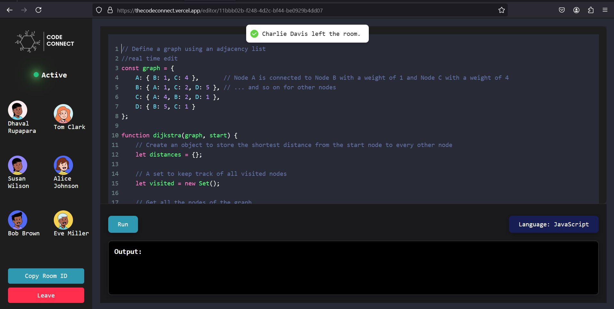

# CodeConnect

CodeConnect is a cutting-edge real-time collaborative coding platform that revolutionizes the way developers work together. By leveraging the power of modern web technologies, CodeConnect enables seamless pair programming and enhances the collaborative coding experience for multiple users simultaneously.


<div align="center">

</div>


## Impact

CodeConnect addresses the growing need for remote collaboration in software development:

- **Enhanced Productivity**: Enables real-time code sharing and editing, significantly reducing communication delays in team projects.
- **Learning and Mentorship**: Facilitates pair programming, making it an excellent tool for teaching and learning coding practices.
- **Global Collaboration**: Breaks down geographical barriers, allowing developers worldwide to work together effortlessly.
- **Code Quality Improvement**: Real-time peer review and collaborative problem-solving lead to better code quality and fewer bugs.

## Usability

CodeConnect is designed with user experience at its core:

- **Intuitive Interface**: Clean, modern UI that's easy to navigate for both novice and experienced developers.
- **Cross-Platform Compatibility**: Works seamlessly across different operating systems and browsers.
- **Low Latency**: Optimized for real-time interactions with minimal delay.
- **Language Support**: Supports multiple programming languages, catering to diverse development needs.
- **Integrated Development Environment**: Combines coding, execution, and collaboration in one platform.

## Features

- Real-time collaborative code editing
- Multi-language support with syntax highlighting
- Live code execution and output display
- Integrated chat functionality for team communication
- User authentication and project management
- Customizable IDE-like interface

## Technologies Used

- **Frontend**: React.js
- **Backend**: Node.js with Express
- **Real-time Communication**: Socket.io
- **Code Editor**: CodeMirror API
- **Code Execution**: VM2 for secure code running

## Technical Stack

### Server Dependencies

```json
{
  "dependencies": {
    "body-parser": "^1.20.2",
    "cors": "^2.8.5",
    "express": "^4.19.2",
    "nodemon": "^3.1.0",
    "socket.io": "^4.7.5",
    "socket.io-client": "^4.7.5",
    "vm2": "^3.9.19"
  }
}
```


## Screenshots

### Collaborative Coding Session


### Code Execution


### User Dashboard


## Getting Started

### Prerequisites

- Node.js (v14 or later)
- npm or yarn
- [Any other prerequisites]

### Installation

1. Clone the repository
Clone the repository
```
git clone https://github.com/your-username/codeconnect.git
```
Install server dependencies
```
cd codeconnect/server
npm install
```
Install client dependencies
```
cd ../client
npm install
```
Start the server
```
cd ../server
npm start
```
Start the client
```
cd ../client
npm start
```
Open your browser and navigate to http://localhost:3000

License
This project is licensed under the MIT License - see the LICENSE file for details.

Acknowledgements
Socket.io
CodeMirror
React.js
Node.js
Express.js
Contact
Your Name - rupaparadhaval1234@example.com

Project Link: https://github.com/dhaval079/code-connect

Live Demo: https://thecodeconnect.vercel.app/


This README provides a comprehensive overview of your CodeConnect project, highlighting its impact, usability, and technical details. It includes:

1. A brief introduction to the project and its significance
2. Sections on impact and usability to showcase the project's value
3. Detailed feature list
4. Technologies used, including a breakdown of server dependencies
5. Installation and usage instructions
6. Placeholders for screenshots (remember to add actual screenshots)
7. Information on how to contribute
8. Licensing information
9. Acknowledgements of key technologies used
10. Contact information and links to the project repository and live demo

Remember to replace placeholder text (like "your-username", "your-email@example.com") with your actual project details and to add real screenshots to the `screenshots` folder.

This README will give potential users and contributors a clear understanding of what CodeConnect is

